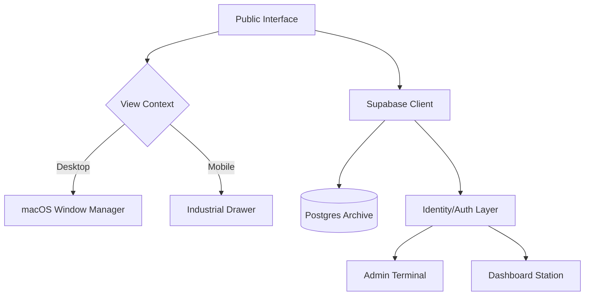

# 🏛️ PYQ's HUB | INDUSTRIAL ACADEMIC ARCHIVE


> **"Preparation is 90% of the battle. Discipline is the rest."**
> 
> PYQ's Hub is a high-fidelity, industrial-grade SaaS platform designed for engineering students. It provides a structured, secure, and rapid-access terminal for historical university question papers, replacing fragmented sources with a centralized academic archive.

---

## ⚡ CORE CAPABILITIES

### 🗄️ Industrial Archive Explorer
A robust filtration interface for identifying documents with sub-second latency. Supports deep-link redirection for major exam cycles (CAT-1, CAT-2, FAT).

### 🖥️ macOS Interactive Window Manager
Experience documents through a premium, native-feeling window terminal. Featuring macOS traffic lights, smooth draggability, and responsive resizing for an elite viewing experience.

### 🛡️ Student Identity Terminal (Dashboard)
A secure workspace tracking Prep Velocity, Archive Clearance, and Verified Identity. Monitor your study journey with real-time industrial statistics.

### 🌓 Multi-State UI Architecture
Seamless transition between a warm "Academic Paper" light mode and a high-focus industrial dark aesthetic, optimized for long study sessions.

---

## 🎬 CINEMATIC SHOWCASE

````carousel

<!-- slide -->

<!-- slide -->

````

### 🎥 Interaction Demo

*Visualizing the fluid navigation and high-fidelity dashboard interactions.*

---

## 🛠️ TECH STACK

| Component | Technology | Rationale |
| :--- | :--- | :--- |
| **Framework** | [Next.js 14](https://nextjs.org/) | App Router for modern server-side architecture. |
| **Backend** | [Supabase](https://supabase.com/) | Real-time Postgres data and secure Auth. |
| **Styling** | [Tailwind CSS](https://tailwindcss.com/) | Industrial tokens and pixel-perfect design. |
| **Icons** | [Lucide React](https://lucide.dev/) | Consistent, minimal technical iconography. |
| **State** | [Context API](https://react.dev/) | Global View management for the Window Terminal. |

---

## 🏗️ SYSTEM ARCHITECTURE



---

## 🚀 ACCELERATED START

### 1. Initialize Local Terminal
```bash
git clone https://github.com/Naein19/PYQ-S-HUB.git
cd pyqs
npm install
```

### 2. Configure Extraction Keys
Create a `.env.local` based on `.env.example`:
```env
NEXT_PUBLIC_SUPABASE_URL=your_project_url
NEXT_PUBLIC_SUPABASE_ANON_KEY=your_anon_key
```

### 3. Ignition
```bash
npm run dev
```

---

## ⚖️ ACADEMIC DISCIPLINE
This project is built with integrity. All documents are verified for authenticity before being inducted into the archive. Join the mission to structure academic preparation globally.

---
<p align="center">
  <b>Built for VITAP Students with Precision.</b><br>
  <sub>Managed by Naveen | Industrial Academic Standards V1.0</sub>
</p>
