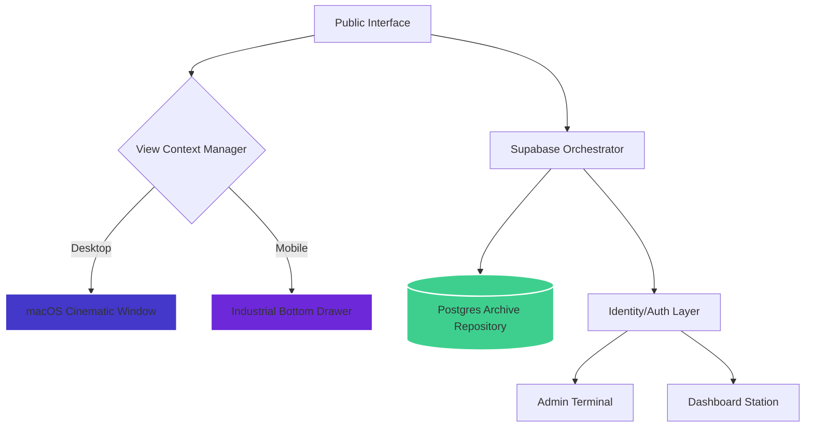

# 🏛️ PYQ's HUB | THE INDUSTRIAL ACADEMIC ARCHIVE

<p align="center">
  
</p>

<p align="center">
  <a href="#-core-capabilities"></a>
  <a href="#-tech-stack"></a>
  <a href="#-tech-stack"></a>
  <a href="#-tech-stack"></a>
</p>

> **"Preparation is 90% of the battle. Discipline is the rest."**
> 
> PYQ's Hub is a high-fidelity, industrial-grade SaaS platform engineered for peak academic performance. It serves as a centralized, secure, and rapid-access terminal for historical university intelligence, replacing fragmented data with a structured industrial archive.

---

## ⚡ CORE CAPABILITIES

### 🗄️ Industrial Archive Explorer
A high-throughput filtration interface designed for sub-second document identification. Features deep-link redirection for major exam cycles (CAT-1, CAT-2, FAT) with precision-mapped course metadata.

### 🖥️ macOS Interactive Window Manager
Experience documents through a premium, native-feeling window terminal. Engineered with macOS traffic light mechanics, fluid-drag physics, and responsive dimensional scaling for an elite archival experience.

### 🛡️ Student Identity Terminal (Dashboard)
A secure workspace tracking **Prep Velocity**, **Archive Clearance**, and **Verified Identity**. Monitor your study trajectory with real-time industrial statistics and telemetry-style activity logs.

### 🌓 Multi-State UI Architecture
Seamlessly oscillate between a warm **"Academic Paper"** light mode and a high-focus **Industrial Dark** aesthetic, optimized for extended cognitive sessions.

---

## 🎬 CINEMATIC SHOWCASE

````carousel

<!-- slide -->

<!-- slide -->

````

### 🎥 Interaction Telemetry

*Visualizing fluid navigation and high-fidelity dashboard interactions.*

---

## 🏗️ SYSTEM ARCHITECTURE (ELITE SCHEMATIC)

The platform is architected with a separation of concerns between the **Archive Layer** and the **View State Manager**, ensuring a seamless transition across devices.



---

## 🛠️ TECH STACK (2026 STANDARDS)

| Layer | Technology | Precision Rationale |
| :--- | :--- | :--- |
| **Framework** | [Next.js 14.2](https://nextjs.org/) | App Router architecture for optimized SSR/ISR. |
| **Data Engine** | [Supabase](https://supabase.com/) | Real-time Postgres synchronization and modular Auth. |
| **Styling** | [Tailwind CSS](https://tailwindcss.com/) | Industrial design tokens and neo-brutalist layouts. |
| **Typography** | [Google Fonts](https://fonts.google.com/) | Inter (Sans) & JetBrains Mono for a technical edge. |
| **State** | [React Context](https://react.dev/) | Global View management for the Window Terminal. |
| **Verification** | [System Analytics](https://vercel.com/) | Real-time telemetry and user interaction tracking. |

---

## 🚀 PIN-TO-PIN SETUP GUIDE

### 1. Environmental Configuration
Initialize your local terminal and replicate the environment signature:
```bash
git clone https://github.com/Naein19/PYQ-S-HUB.git
cd pyqs
npm install
```

### 2. Extraction Keys
Create a `.env.local` to bridge the identity layer with the archive:
```env
NEXT_PUBLIC_SUPABASE_URL=https://your-project.supabase.co
NEXT_PUBLIC_SUPABASE_ANON_KEY=your-secure-anon-key
```

### 3. Archive Ignition
```bash
# Start the development terminal
npm run dev

# Generate high-fidelity production build
npm run build
```

---

## 🛡️ ACADEMIC DISCIPLINE & INTEGRITY
This platform is built on the foundation of academic integrity. Every document inducted into the archive undergoes a **Verification Protocol** to ensure authenticity. We are on a mission to structure global academic preparation for the next generation of engineers.

---

<p align="center">
  <b>Built for VITAP Excellence with Neo-Industrial Standards.</b><br>
  <sub>Managed by Naveen | Version 1.0.0-Stable | 2026.03</sub>
</p>
